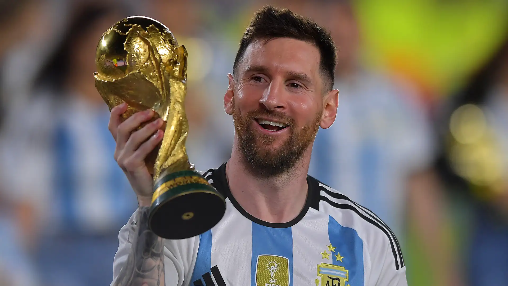

# Ranking futbolistas históricos
Top 10 futbolistas historicos
1. **Leo Messi**

gaga

________________________________________________________

2. **Diego Maradona**

gaga

________________________________________________________

3. **Pele**

gaga

________________________________________________________

4. **Alfredo Di Stefano**

gaga

________________________________________________________

5. **Johan Cruyff**

gaga

________________________________________________________

6. **Cristiano Ronaldo**

gaga

________________________________________________________

7. **Ronaldo Nazario**

gaga

________________________________________________________

8. **Franz Beckenbauer**

gaga

________________________________________________________

9. **Ronaldinho**

gaga

________________________________________________________

10. **Van Basten**

gaga

________________________________________________________

[Google](https://github.com/JonEL1010/Inicial/blob/main/messi.md)****
